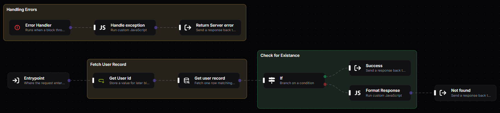

  

  
<b>The production-grade, low-code agentic backend platform.</b> 
  <i>Build, orchestrate and scale APIs and workflows visually.</i>

  

    
    
    
  

  

---

Fluxify turns a visual workflow into a real, compiled API. You draw the flow, and
it is translated into JavaScript once, when you save. Requests run that code
directly, with no graph walking. Read more:

- [What is Fluxify](https://docs.fluxify.rest/getting-started/) and its [core concepts](https://docs.fluxify.rest/concepts/)
- [Blocks](https://docs.fluxify.rest/blocks/): the building pieces of a workflow, including [custom blocks](https://docs.fluxify.rest/blocks/custom-blocks)
- [Architecture](https://docs.fluxify.rest/architecture/) and [performance benchmarks](https://docs.fluxify.rest/architecture/performance)
- [Integrations](https://docs.fluxify.rest/integrations/): databases, key-value stores, message queues, AI models, observability

---

## Run it

- [**Kit**](https://docs.fluxify.rest/deployments/kit): the whole platform in one container. Best for trying it out.
- [**Production**](https://docs.fluxify.rest/deployments/production): admin, orchestrator and scaled workers, and [which image tag to pull](https://docs.fluxify.rest/deployments/production#image-tags).

---

## Contributing

Fluxify is a Bun monorepo. From a fresh clone to a running stack takes five
commands: see the [contributing guide](https://docs.fluxify.rest/getting-started/contributing) or [CONTRIBUTING.md](CONTRIBUTING.md). Opening a pull request accepts
the [CLA](CLA.md), and there is nothing to sign.

## License

Apache License 2.0 for the open-source code ([LICENSE](LICENSE)). Code in `ee/`
directories and `*.ee.*` files is under the
[Enterprise Edition License](LICENSE_EE): free for personal, educational and
non-profit use, and a license key for commercial use. See
[Editions and licensing](https://docs.fluxify.rest/deployments/licensing).

## Links

[Documentation](https://docs.fluxify.rest) · [Website](https://www.fluxify.rest) · [Issues](https://github.com/Fluxify-rest/Fluxify/issues) · [Discussions](https://github.com/Fluxify-rest/Fluxify/discussions)
