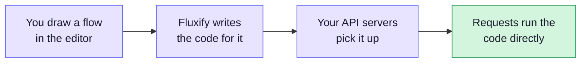

# Architecture

This section explains what happens between the moment you save a route and the
moment somebody calls it. You don't need to read it to use Fluxify — but if you
are self-hosting, tuning performance, or just curious why your API is fast, this
is the map.

## The short version

Fluxify does not interpret your flowchart on every request. It **translates
your flowchart into JavaScript once, when you save it**, and then runs that
JavaScript directly for every request afterwards.

Think of the difference between a translator standing next to you repeating
every sentence, and simply learning the language. The first has to do the work
again for every sentence. The second did the work once.

## The two halves

Fluxify splits into two halves that do very different jobs. Understanding this
split explains most of the deployment choices you'll make.

| | **Control plane** | **Request workers** |
|---|---|---|
| What it does | Where you build things | Where your API runs |
| Who talks to it | You and your team | Your users |
| Touches the database | Yes | **Never** |
| How you scale it | One is usually plenty | Add more as traffic grows |
| If it goes down | You can't edit — your API keeps serving | That API stops responding |

::: tip Why the workers never touch the database
Workers receive your routes already translated into code. They have no reason
to read your database, so they are never given the credentials to. A bug in
your API logic cannot reach the tables that store your account, your projects,
or anyone else's work.
:::

```mermaid
flowchart TB
    subgraph CP["Control plane — where you work"]
        UI["Editor and dashboard"]
        API["Management API"]
        COMP["Translator"]
        UI --> API --> COMP
    end

    subgraph SHARED["Shared services"]
        DB[("Database<br/>your flows, users, settings")]
        BUS["Message bus<br/>delivers translated routes"]
    end

    subgraph RW["Request workers — where your API runs"]
        W1["Worker"]
        W2["Worker"]
        W3["Worker"]
    end

    API --> DB
    COMP --> DB
    COMP --> BUS
    BUS --> W1 & W2 & W3
    USERS(["Your users"]) --> W1 & W2 & W3

    style CP fill:#f4f2ff,stroke:#5f67ee,color:#1a1a2e
    style RW fill:#eefaf2,stroke:#2b9d5b,color:#1a1a2e
    style SHARED fill:#fff8e6,stroke:#d9a441,color:#1a1a2e
    style USERS fill:#ffe8e8,stroke:#d9534f,color:#1a1a2e
```

## Where to go next

- **[Request Lifecycle](/architecture/request-lifecycle)** — the full journey of
  a route, from the moment you hit Save to the moment a user gets a response.
- **[Performance](/architecture/performance)** — what the translation step
  actually buys you, with measured numbers.
- **[Deployments](/deployments/)** — how to run all of this yourself.
