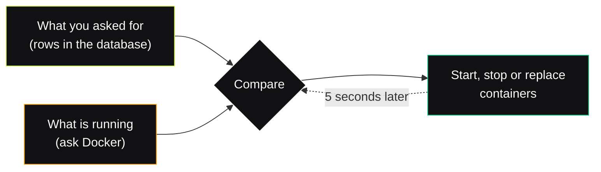
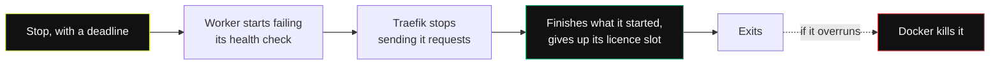

# The Orchestrator

Somebody has to start the worker containers. On a production stack, that
somebody is a small program called the **orchestrator**.

This page explains how it works. You don't need it to run Fluxify — for that,
read [Production](/deployments/production#orchestrator). Read this if you want
to know why it makes the choices it makes, or if you're changing it.

## The one-paragraph version

You write down how many workers you want and what each one should serve. The
orchestrator reads that, looks at what is actually running, and fixes the
difference. Then it waits five seconds and does it again. Forever.

That's the whole program. Everything below is a consequence of it.



## Why a loop, and always in that direction

The loop compares **what should be running** against **what is running**, and
only ever changes the second one.

It would be tempting to skip the database and just look at the containers —
whatever is running is what was wanted, surely? But then two things become
impossible. You can't tell the difference between a node somebody deleted and a
node that crashed, so you can never correct a mistake. And if you wipe the
message bus or move to a new host, nothing is left that remembers what you
wanted. The written-down request is the only copy that survives.

A loop also means nothing has to be told twice. You don't send the orchestrator
a "please scale up" message that could get lost — you change the row, and the
next pass notices. A message can be missed. A comparison cannot.

::: tip Five seconds is the floor, not the target
The loop polls. It has no "something changed, wake up" signal, because today
nothing writes claims except a human in the UI, and waiting five seconds for a
container to appear is fine. When that stops being fine, the wake-up is a small
addition — the loop stays exactly as it is.
:::

## What you're actually asking for: a claim

A claim is one row that says *"I want this many workers, doing this job, for
this project."* Replicas, a mode, a list of trigger groups.

```
2 replicas · mode: both · project: all · groups: all
```

The orchestrator turns one claim into one node per replica, checks each against
your licence and your pool size, and starts containers for the ones that fit.

::: warning A claim is a request, not a promise
If you ask for six nodes and your pool allows two, four of them sit there
marked **pending / pool_unavailable**. That is not a bug, and the orchestrator
will not quietly start them anyway. What you asked for and what you have are
two different numbers, and both are worth showing you.
:::

## Only one orchestrator acts at a time

Two of them reconciling at once would both see "no container for node 3" and
both create it. So before any pass, a process has to hold the **lease**.

The lease is one key with a countdown on it:

1. Nobody holds it → write it. You're the leader.
2. You hold it → rewrite it every pass to restart the countdown.
3. You stop (crash, freeze, get paused) → the countdown runs out, the key
   vanishes, and the standby writes it on its next pass.

The renewal is the important part. It says *"replace this key, and only if it is
still exactly the version I last wrote."* So a leader that was frozen for
fifteen seconds and wakes up thinking it is still in charge gets refused — the
key it remembers is gone, and someone else's is there now. It stands by instead.

A clean shutdown deletes the key, so the standby takes over immediately rather
than waiting out the countdown.

::: tip Active/standby, not sharded
Both processes run the same loop; one just does nothing. There is no work to
split, because Docker containers live on one host — there is no second host to
divide them between. Sharding becomes meaningful with Kubernetes, and the key
layout already leaves room for it.
:::

## It can only see its own containers

Every container the orchestrator creates is labelled
`fluxify.managed-by=orchestrator`. Every time it asks Docker what's running, it
asks with that label as a filter.

This is stronger than it looks. The orchestrator doesn't fetch everything and
then skip what isn't its own — **Docker never tells it about anything else**. A
worker you started by hand, your database container, the thing you're debugging:
all invisible, and so none of them can be mistaken for something to clean up.
A loop that deletes what it doesn't recognise should not be able to see your
Postgres.

## What forces a replacement, and what doesn't

A container is thrown away and rebuilt for exactly two reasons:

| Change | What happens |
|---|---|
| The worker image moved | Replace the container |
| The node's project changed | Replace the container |
| The node's mode changed | **No restart** |
| Its trigger groups changed | **No restart** |

The first two are baked into the container when it is created, so there is no
way to change them in place. The last two travel a different road: the
orchestrator writes each node's job into a small record on the message bus, and
the worker watches its own record and applies a new group list where it stands.

That's the difference between "this node now also serves group B" taking effect
in a second and taking a container restart plus a cold start. Restarts are the
expensive option, so they are reserved for the two cases that genuinely need one.

## A node's name is worked out, not assigned

A node's id is its claim's id and its replica number, joined with a dot:

```
0192b1c4-1111-7000-8000-000000000001.0
```

Nothing generates it and nothing stores it. That has two nice effects. A
container that gets replaced comes back with the same id, so the job record
written for it is still the right one. And the same string is the container
label, the worker's own `FLUXIFY_NODE_ID`, and the primary key of its row in the
database — so a row and a heartbeat can be matched up with no lookup table
between them.

## Stopping a node politely

Removing a worker isn't `docker kill`. It's a stop with a deadline:



The deadline is the worker's own drain window plus a margin, so a worker that
drains properly is never the one being cut off.

## When it refuses to act

Two situations look similar and are treated very differently:

| Situation | Running workers |
|---|---|
| Licence lapsed or downgraded | **Left running.** Only a restart is refused. |
| You shrank the pool | **Removed.** |

A licence problem is usually a billing hiccup, and taking a customer's API down
over one is the wrong trade — nobody thanks you for enforcing a limit at 3am. A
smaller pool, on the other hand, is something an operator typed on purpose, so
it is carried out.

Crashes aren't in this table at all, because they aren't the orchestrator's job.
Each container carries Docker's own `unless-stopped` policy, so the platform
restarts it in milliseconds without anyone being consulted. The orchestrator
only steps in once a container is actually **gone**.

## The Docker socket is the risk

The orchestrator holds the Docker socket, which is root on the host in a
trenchcoat. Anything that can send it a container-create request can start a
privileged container and own the machine.

So the interesting question isn't whether the orchestrator is careful — it's how
small a vocabulary it speaks:

- **One image, from an environment variable.** Not a default, not a fallback —
  the whole allowlist. An image name can never arrive from a database row.
- **One place builds a create request**, and it's a pure function with no I/O.
- **Every id is checked** against the exact shape the database generates before
  it becomes a label, an environment variable, or part of a container name.
- **It runs none of your code.** Workflows, scripts, integrations — none of it
  executes in this process. That's what the workers are for, and they hold no
  socket.

The orchestrator also never passes database credentials down to a worker, which
is the same rule as everywhere else in Fluxify: workers don't talk to the
database, and nothing gives them the option.

## Who owns which container

Two things managing the same container will fight over it, so nothing is shared:

| Owner | Containers |
|---|---|
| Compose | nats, postgres, valkey, traefik, admin, **orchestrator** |
| The orchestrator | **every worker** |

There is no `worker` service in the compose file. A fresh stack seeds one
catch-all claim and a pool ceiling of two, which reproduces exactly what the old
`worker` service did — so a first-time deployment serves traffic without anyone
opening the UI.

> [!WARNING]
> `docker compose --remove-orphans` deletes every worker. Compose sees
> containers it didn't create and tidies them up. They come back on the next
> pass, but requests fail in the meantime.

## Settings

| Variable | Default | What it's for |
|---|---|---|
| `ORCHESTRATOR_WORKER_IMAGE` | *required* | The only image a worker is created from |
| `ORCHESTRATOR_NETWORK` | `fluxify_net` | The network workers join — must be Traefik's |
| `DOCKER_HOST` | the socket | `unix://…` in a container, `tcp://host:port` locally |
| `ORCHESTRATOR_RECONCILE_INTERVAL_MS` | `5000` | How often it compares, and renews its lease |
| `ORCHESTRATOR_HEALTH_PORT` | `5800` | Where `/health` and `/ready` live |
| `ORCHESTRATOR_SEED_DEFAULT_CLAIM` | `true` | Whether a fresh stack starts with one worker |

::: warning Windows named pipes don't work
The orchestrator talks to Docker with plain `fetch`, and Bun cannot open a
Windows named pipe. For local development, turn on
*Settings → General → expose the daemon on tcp://localhost:2375* and set
`DOCKER_HOST=tcp://localhost:2375`.
:::

## Where the code lives

Each file does one thing, and the two that decide anything are pure functions
with no I/O — which is why they are the ones with tests.

| File | Job |
|---|---|
| `deployments/orchestrator.ts` | The process: connect, then loop |
| `orchestrator/leader.ts` | Holding the lease |
| `orchestrator/desired.ts` | Reading claims, pool and licence |
| `orchestrator/plan.ts` | Desired vs running → a list of actions *(pure)* |
| `orchestrator/containerSpec.ts` | One node → one create request *(pure)* |
| `orchestrator/docker.ts` | Every call to the daemon |
| `orchestrator/reconciler.ts` | Running one pass |
| `orchestrator/records.ts` | The node rows and history the UI reads |
| `orchestrator/assignments.ts` | The job record each worker watches |

A failing action is logged and recorded, never thrown. One image that won't pull
must not stop the other nodes in the same pass from being fixed.

## What it doesn't do yet

- **Per-project routing.** Project-pinned nodes get no edge labels, because the
  rule needs a subdomain that doesn't exist yet. Only catch-all nodes take
  traffic today.
- **Replacement without a gap.** A node being replaced is briefly gone. Starting
  the new one first needs a spare licence slot the cap doesn't allow.
- **Rebalancing.** A claim is placed once and stays. Nothing shuffles nodes
  between hosts to tidy up utilisation, and on a single Docker host there is
  nowhere to shuffle them to.

## Where to go next

- **[Production](/deployments/production#orchestrator)** — running it, in the
  operator's words rather than the implementer's.
- **[Editions](/deployments/editions)** — how many nodes your licence allows.
