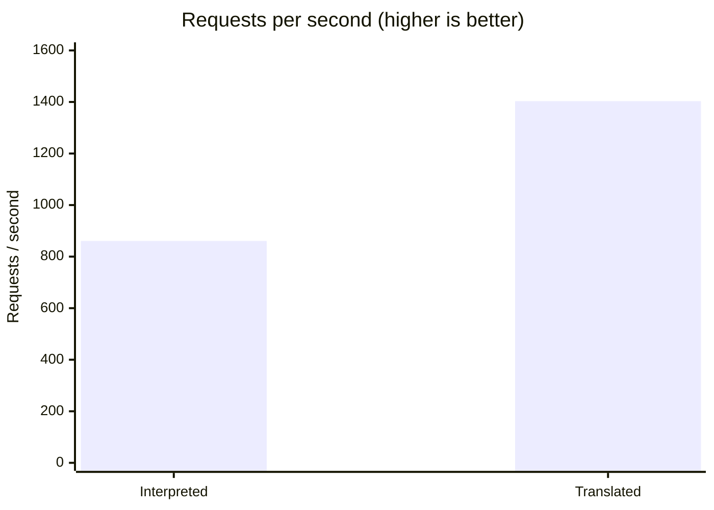
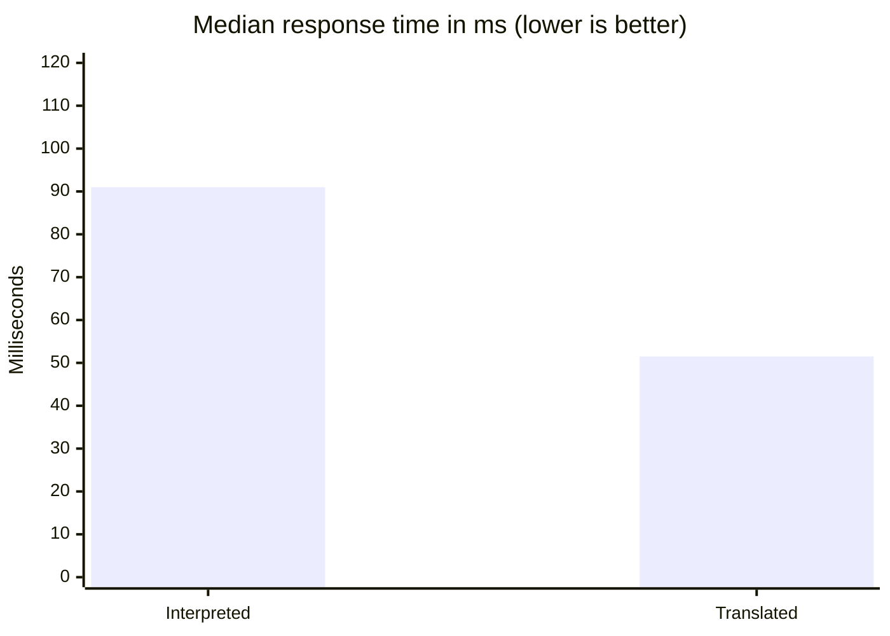

# Performance

The [Request Lifecycle](/architecture/request-lifecycle) page explains that
Fluxify translates your flow into code once, at save time, instead of walking
it on every request. This page shows what that's actually worth.

::: info About these numbers
This is one benchmark on one machine, run against a demo route. Your results
will differ — a route that spends 200 ms waiting on a slow external API will be
dominated by that wait, not by Fluxify. Treat the **ratios** as the meaningful
part, not the absolute figures.
:::

## The test

A load generator ramped up to **100 concurrent users over 60 seconds** and
called a single route as fast as it could.

| | |
|---|---|
| Route | `GET /users?id=…` — reads one row and returns it |
| Traffic mix | ids 1–2 exist (returns the row), ids 3–10 don't (returns 404) |
| Concurrency | ramped to 100 simultaneous users |
| Duration | 60 seconds |
| Environment | containers on a single developer machine |

Both engines ran the **same route, same data, same traffic mix** — around 20%
found the row, around 80% correctly returned a 404. The 404s aren't errors in
the test; they exercise the full pipeline (match the path, validate, run the
route, query, return) and just happen to find no row.

## Results

### Throughput

| | Interpreted | Translated | Change |
|---|---|---|---|
| Requests per second | 860.7 | **1,403.2** | **+63%** |
| Requests in 60s | 51,650 | **84,198** | +63% |

### Response time

| | Interpreted | Translated | Change |
|---|---|---|---|
| Average | 87.1 ms | **53.3 ms** | −39% |
| Median | 91.0 ms | **51.5 ms** | −43% |
| 90th percentile | 124.8 ms | **88.4 ms** | −29% |
| 95th percentile | 134.8 ms | **101.1 ms** | −25% |
| Fastest request | 4.09 ms | **0.53 ms** | −87% |

Measured only on the requests that found a row and returned data:

| | Interpreted | Translated | Change |
|---|---|---|---|
| Average | 104.1 ms | **71.4 ms** | −31% |
| Median | 111.9 ms | **72.5 ms** | −35% |
| 95th percentile | 151.9 ms | **120.6 ms** | −21% |

### Resources

| | Interpreted | Translated | Change |
|---|---|---|---|
| Memory | 256 MB | **210 MB** | −18% |
| CPU | 130% | **120%** | −8% |
| **CPU time per request** | 1.51 ms | **0.86 ms** | **−43%** |

## Reading the results

**Throughput and latency improved together.** Normally you trade one for the
other: push more requests through and each one waits longer. Here the server
handled 63% more traffic *while* responding faster, using less memory and less
CPU. That only happens when each request genuinely got cheaper — which is
exactly what removing the per-request interpretation does.

**The floor is the clearest signal.** The fastest request went from 4.09 ms to
0.53 ms. With no queueing and no contention, that figure is close to pure
per-request overhead — and it dropped by a factor of about eight.

**CPU per request is the number that matters for your bill.** At 0.86 ms of CPU
per request instead of 1.51 ms, the same hardware serves roughly 75% more
traffic. In practice that's the difference between three servers and two.

**One caveat, honestly stated.** The slowest single request was *worse* on the
translated engine (258 ms vs 215 ms), even though every percentile up to the
95th improved. That's a small number of outliers, most likely ordinary garbage
collection or noise from sharing a developer machine — not a pattern users
would feel. It's listed here rather than omitted.

## What this means for you

You don't have to do anything to get this. There's no setting to enable and no
different way to build your flows — translation is simply how Fluxify runs.

What it changes is what you can expect:

- **Simple routes get very fast.** With per-request overhead near zero, a route
  that just reads and returns data is limited by your database, not by Fluxify.
- **Your hosting goes further.** Roughly 43% less CPU per request means fewer
  servers for the same traffic.
- **Complex flows benefit most.** The savings scale with how many blocks your
  flow has, because every one of them used to cost interpretation on every
  single request.

::: tip Where Fluxify is *not* the bottleneck
If your route calls a slow external service, waits on a heavy database query,
or processes a large payload, that work dominates and these gains are a small
share of the total. This benchmark measures the engine's own overhead, which is
precisely the part that used to be avoidable.
:::

## Running it yourself

The load-testing setup lives in `testing/load-testing` in the repository, and
the [Deployments](/deployments/) guide covers standing up a stack to point it
at. Use your own routes and your own data — a benchmark of someone else's
workload only ever tells you so much.
