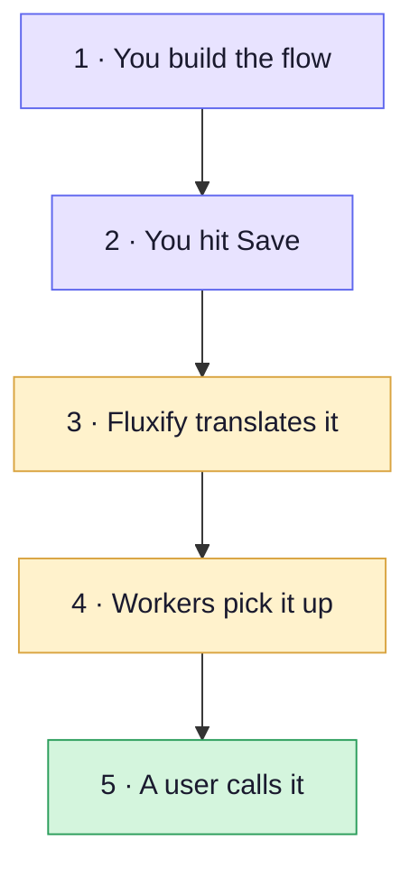
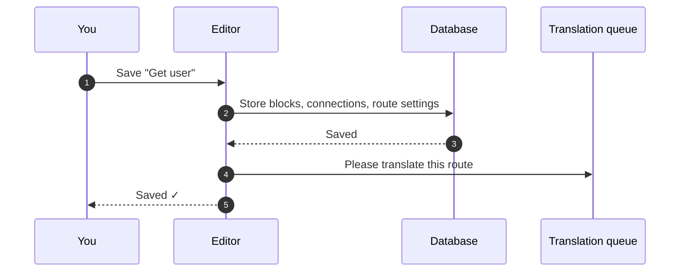
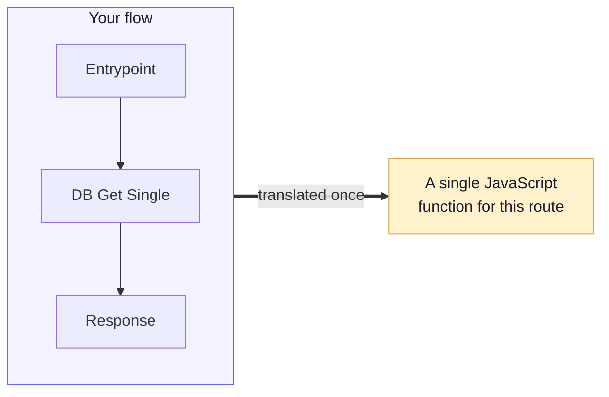
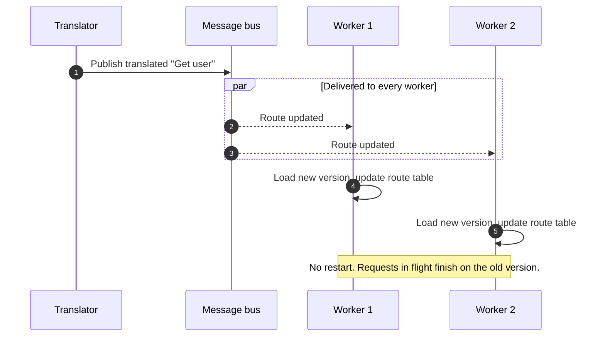
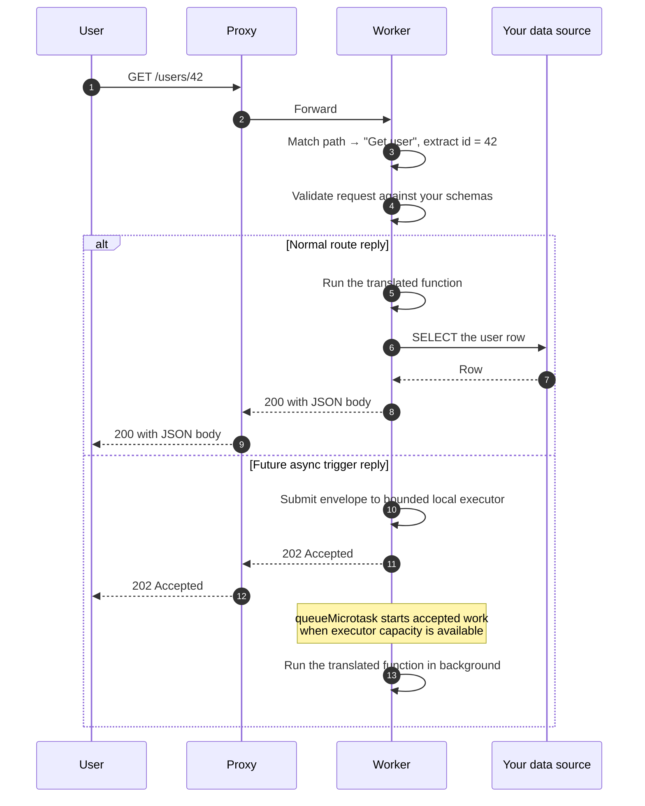
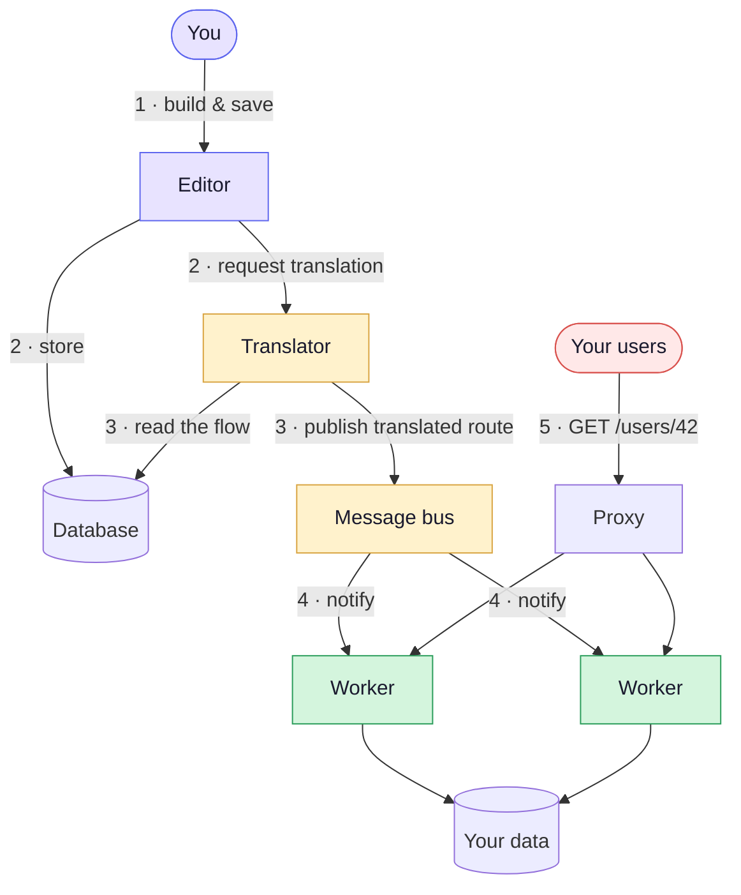

# Request Lifecycle

This page follows one route all the way through: you create it, you save it,
Fluxify translates it, your servers pick it up, and a user calls it.

We'll use a running example — a route called **Get user** at
`GET /users/:id` that reads a row from your database and returns it as JSON.

## The whole journey at a glance

Steps 3 and 4 are automatic and usually finish in well under a second. You
never trigger them yourself.

---

## Step 1 · You build the flow

In the editor you drag out blocks and connect them. For our example:

**Entrypoint** → **DB Get Single** → **Response**

You also define the route itself: the method (`GET`), the path (`/users/:id`),
and optionally schemas describing what the request should look like.

::: info Path parameters
The `:id` in `/users/:id` is a placeholder. A call to `/users/42` matches it,
and your blocks can read `42` as the `id` parameter.

If you later edit the path so it no longer has any `:placeholders`, the
parameter schema is cleared automatically — leaving a description of parameters
that can no longer be sent would only cause confusing validation errors.
:::

At this stage nothing is running yet. Your flow is a drawing.

## Step 2 · You hit Save

Saving stores the flow in the database and immediately asks for a translation.

The save returns as soon as your work is safely stored. The translation happens
right behind it, so the editor never makes you wait on it.

## Step 3 · Fluxify translates the flow

This is the step that makes everything else fast.

Fluxify walks your flow starting at the Entrypoint and follows the connections
to the end, writing out real JavaScript as it goes. Each block contributes the
code that does its job:

| Block in your flow | Becomes something like |
|---|---|
| Set Variable | an assignment |
| If Condition | an `if / else` |
| For Loop | a `for` loop |
| DB Get Single | a database query |
| JS Runner | your own code, inlined as written |
| Response | the value that gets returned |

Blocks connected *after* another block become code nested inside it. A For Loop
with three blocks attached to it produces a loop with those three steps in its
body — exactly the shape you drew.

The result is one self-contained function per route. There is no flowchart left
to walk at request time — the shape of your flow has become the shape of the
code.

Translated routes are published to a message bus, which both stores the latest
version and notifies every worker that it changed.

::: warning If a flow can't be translated
Translation can fail — for example if a block is missing required settings.
When that happens the previous working version keeps serving traffic, and the
error is reported back to you in the editor. A broken save never takes your API
down.
:::

## Step 4 · Workers pick it up

Every request worker watches for updates. When a new translation is published,
each worker receives it and swaps it in.

Two things worth knowing:

- **No restart, no redeploy.** The swap happens in place, usually within a
  second of saving.
- **Workers start up independently.** A worker that boots before anything has
  been translated simply waits, and reports itself as *not ready* so your load
  balancer doesn't send it traffic yet.

## Step 5 · A user calls the route

Now someone requests `GET /users/42`.

Matching the path is a lookup, not a search — adding more routes doesn't slow
down the ones you already have. Everything after the match is your route's own
code running directly.

### Foundation for future async triggers

The worker already has a bounded, process-local async executor. It accepts the
same transport-neutral route envelope as HTTP dispatch, returns an immediate
`202` once accepted, and starts detached work through `queueMicrotask`. This is
an internal foundation only: there is not yet a dashboard route setting or
supported public trigger endpoint that schedules work this way.

Future webhook, route-to-route, NATS/JetStream, Kafka, SQS, RabbitMQ and cron
adapters can all submit into this boundary. A later distributed workflow system
can replace the local executor with durable JetStream scheduling without
changing route execution itself.

The local runner defaults to 10 in-flight jobs and 100 queued jobs per worker.
When full, it rejects new async submissions with `429` rather than retaining
unbounded request bodies. It is for I/O-bound work only: JavaScript loops,
image/file processing, and other CPU-heavy work still share the execution
process event loop and can delay ordinary routes. Those workloads need a
dedicated CPU-worker design.

### What the worker is *not* doing

This is the interesting part, and the reason for the numbers on the
[Performance](/architecture/performance) page. On every single request, the
worker does **not**:

- load your flow from the database
- figure out which block comes next, over and over
- look up how each block type behaves
- pass results between blocks through a generic envelope

All of that happened once, at save time.

---

## Putting it all together

## Common questions

**How long after saving is my change live?**
Usually under a second. Translation starts the moment you save, and workers
apply the result as soon as it's published.

**What happens to requests that are already running when I save?**
They finish on the version they started with. The swap only affects requests
that arrive afterwards.

**Do I need to restart anything when I change a route?**
No. That's the point of this design.

**One worker serves one project — why?**
Each worker holds the translated routes for a single project, which keeps
projects fully separated from each other. To run several projects, run a group
of workers for each. See [Deployments](/deployments/production).

**Can my route code read my database credentials or other projects' data?**
No. Workers are never given database credentials, and each worker only ever
holds one project's routes and settings.
