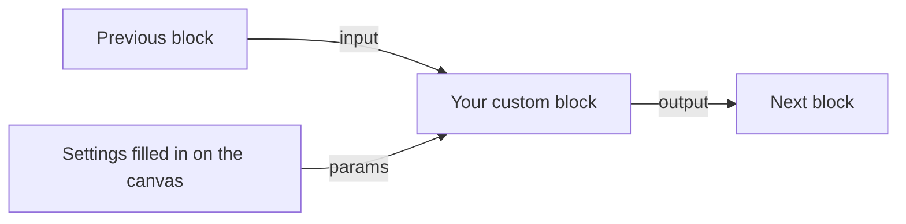

# Custom Blocks

A **custom block** is a block you build yourself. You wire a few existing blocks together once, give the result a name and an icon, and from then on it shows up in the block picker like any built-in block.

Use one when you catch yourself copying the same group of blocks from route to route: sending the same Slack message, checking the same token, calling the same internal API. Build it once, and fix it in one place.

> Want to build one now? Follow the [step-by-step tutorial](./custom-blocks-tutorial.md).

## How it works

A custom block has two sides.

**The inside** is a canvas, just like a route's canvas. It starts at an **Entrypoint**, runs through whatever blocks you add, and whatever the last block produces is what the custom block gives back.

**The outside** is a small settings form that you design. These are the block's **input parameters**. Whoever places your block on a canvas fills them in, the same way they fill in an HTTP Request block's URL and method.

Inside the custom block you can read two things:

| Name | What it is |
| :--- | :--- |
| `input` | The output of the block that came before your custom block. |
| `params` | The settings filled in on the block, for example `params.webhook_url`. |

Both work anywhere a field accepts JavaScript (a `js:` expression, or the JS Runner block).

## Input parameters

Each parameter becomes a field on the block's **Parameters** tab. Pick the kind of field that fits:

| Kind | What the user sees | Good for |
| :--- | :--- | :--- |
| **Text input** | A text box that accepts a `js:` expression | URLs, names, messages |
| **Checkbox** | A tick box | On/off options |
| **Dropdown** | A list of choices you define | A fixed set of options |
| **Array editor** | A list the user can add items to | Lists of values |
| **Integration selector** | A picker for one of the project's [integrations](../integrations/index.md) | Choosing which database or queue to use |
| **App Config selector** | A picker for an [App Config](../concepts/app-config.md) key | Secrets and API keys |

Every parameter has an **identifier** (lowercase letters, numbers and underscores, such as `webhook_url`), a **label** shown to the user, and an optional hint.

> For secrets, prefer the **App Config selector** over a text input. The user picks the *name* of the secret, so the secret itself never gets written into the canvas. Read it inside the block with `getConfig(params.your_identifier)`.

## Using a custom block

Open the block picker on any route or workflow canvas. Your custom blocks are listed there with their icon and description. Drop one on the canvas, connect it, and fill in its **Parameters** tab.

The **General** tab has an **Execution Mode**:

| Mode | What happens |
| :--- | :--- |
| **Synchronous** (default) | The flow waits for the custom block and uses its output. If it fails, the flow fails too. |
| **Asynchronous** | The custom block starts and the flow carries on straight away. Its output is not available. If the server restarts while it is running, the work is lost. |
| **Queued** | The work is saved as a background job and run later. It survives a restart and may be retried, so make it safe to run twice. Only the block's parameters and input are handed over, so request details such as headers, cookies and variables are not available inside it. |

Like other blocks that produce data, a custom block can **save its output to a variable** so later blocks can read it.

## Good to know

- Custom blocks belong to a project. They are available to every route and workflow in that project, and not to other projects.
- When you change a custom block, every route that uses it picks up the change.
- Give the block a clear label and description. Those are what your teammates see in the block picker.
- Keep a block focused on one job. A block that does one thing is easy to reuse.
- You can reopen a custom block's canvas from the **Custom Blocks** page, or from a placed block by pressing **Edit Implementation** on its **General** tab.

## Custom blocks for testing

A custom block can also prepare and clean up data for [test suites](/testing/). Tick **Use only for test suite setup / teardown** in its settings to make it a test-only block: it is hidden from the block picker and never runs in live routes. See [Setup and Teardown](/testing/setup-and-teardown).
