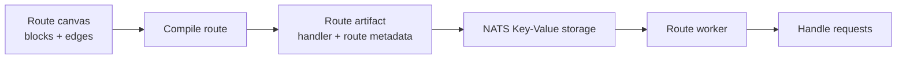

# Blocks

Blocks are the building units of a Fluxify route. A block receives the result from the previous step, does one focused piece of work, and passes its result to the next step.

That is the core rule of the route canvas:

```text
input → block does work → output → next block
```

A clear route is a chain of small, understandable steps. For example, a route might validate a request, look up a record, transform the result, then return a response.

## What a block does

Every block has one job. Depending on its type, that job might be to:

- Read or validate request data
- Run a JavaScript transformation
- Query a database or call an external service
- Make a condition-based decision
- Set response details or return an HTTP response

Each block receives an `input` value from the preceding block. After it finishes, its output becomes the `input` for the next block. Block settings define *how* it performs its job; the edge defines *where* the result goes.

This makes data movement visible. When a value is missing or unexpectedly shaped, follow the route one block at a time and inspect the output produced at each step.

For example, a **Get user record** block can be configured with the database connection and `users` table it should query. Its result is then available to the next block in the route.


## One path at a time

Fluxify routes use an explicit single-path flow:

- A block has one incoming connection and one outgoing connection.
- One block completes before the next one starts.
- An output cannot fan out to several blocks at the same time.
- A route does not infer parallel work from where blocks happen to sit on the canvas.

This is intentional. Relative position is a layout choice, not execution logic. The connections on the canvas make the order and data flow unambiguous.

::: info Branching still stays explicit

A decision can choose which *one* path continues, based on the data it receives. It does not start every possible path. See [Edges](./edges.md) and [Condition Evaluator](./evaluators.md) for the flow controls around blocks.

:::

## Routes cannot contain cycles

A route cannot connect back to an earlier block. Fluxify rejects a cyclic graph when you save it, so it is neither compiled nor stored as a route artifact.

A cycle would create an invalid execution path and could cause a request to run indefinitely. When a step needs to repeat over values, use a JavaScript `for` loop inside the appropriate JavaScript block instead of drawing a connection back to a previous block.


## Design blocks around a single responsibility

Give each block a small, named responsibility. This keeps routes easier to test, change, and debug.

| Prefer | Avoid |
| --- | --- |
| `Validate order payload` → `Create order` → `Return order` | One large block that validates, writes data, calls services, and formats the response |
| Passing the smallest useful output forward | Passing an entire raw response when the next step needs one field |
| A clear response block at the end of a route | Leaving the route without an intentional response |
| A separate step for a risky external call | Hiding several unrelated side effects in a transformation |

When you need JavaScript, keep the script focused on the transformation or decision at that stage. The [Scripting guide](../scripting/index.md) explains the available request context and helpers.

## From canvas to a running route

When you save a route, Fluxify compiles its blocks and edges into a route handler. The compiled route is published as an artifact containing the information needed to serve it—such as its HTTP match details, validation rules, runtime settings, and generated JavaScript.

Those artifacts are stored in NATS Key-Value storage and distributed to route workers. A worker loads the current artifact for a route and uses it to handle requests, so the visual workflow is not interpreted block-by-block for every request.



The important part as a builder is simple: update the route graph, save it, and Fluxify publishes the new route artifact for workers to use.

## Parallel work will be explicit

Parallel execution and fan-out are not supported by ordinary block connections today. An **Orchestrator** block is being developed to make those workflows explicit: it will define which work runs together, how results are joined, and what happens when one branch fails.

Until then, keep routes as one intentional chain. This avoids the hidden ordering rules used by tools that derive execution from a block's x/y position on a canvas.

## Next steps

- Learn how connections carry a result forward in [Edges](./edges.md).
- Learn how conditional routes choose a path in [Condition Evaluator](./evaluators.md).
- Learn what values and helpers a block can access in [Execution Context](./context.md).
