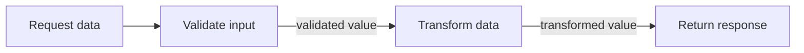
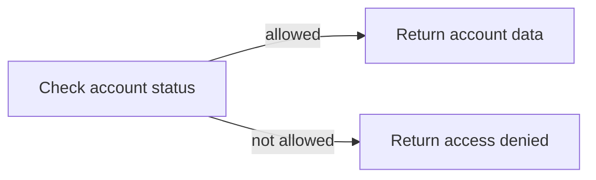

# Edges

Edges are the connections between blocks on a route canvas. They are more than visual lines: each edge states exactly which block runs next and carries the previous block's output forward as the next block's `input`.

```text
Block A output ── edge ──→ Block B input
```

Because the connection defines execution, the canvas stays readable even as a route grows. A block's position is only layout; an edge is the actual instruction to continue the route.

## How an edge operates

An edge has one source block and one destination block. When the source block completes successfully, Fluxify follows its outgoing edge and starts the destination block with the source result as `input`.



In this example, the response block receives the value produced by **Transform data**—not every value produced earlier in the route. Keep that handoff in mind when choosing what a block should return.

Here is the same idea in a complete endpoint. The edges show the main get-user path, a deliberate success/not-found decision, and a separate error path for unexpected failures.


## A route follows one active path

Ordinary edges create a sequential route, not an implicit workflow scheduler:

- One edge enters a block and one edge leaves it.
- The next block waits for the current block to finish.
- A block's result flows to one next block.
- An output cannot be connected to multiple downstream blocks for simultaneous execution.

This means there is always one active path through a route. It prevents the ambiguous behaviour found in visual tools that infer ordering or parallelism from a block's relative x/y position.

## Edges cannot form a cycle

An edge must always move the route forward. Connecting a later block back to an earlier block creates a cycle, which Fluxify rejects when the route is saved. The route will not be compiled or stored, because a cyclic graph produces an invalid execution path and can lead to an infinite loop.

If a route needs to repeat work for a list of values, put that repetition in a JavaScript `for` loop inside a JavaScript block. Do not model it by returning an edge to a previous block.


## Sequential flow

Most routes are a straightforward chain. Use an edge after each focused piece of work:

```text
Parse request → Validate → Fetch data → Format response → Respond
```

This is the best choice when each step depends on the prior result. For example, a database lookup must receive a validated identifier before it can run.

## Decision paths

Condition blocks can select which path continues based on their `input`. The decision is explicit in the route graph, and only the selected destination continues for that request.



This is branching, not fan-out: a request takes one of the paths. See [Condition Evaluator](./evaluators.md) for the rules used to make a decision.

## Error flow

Routes can also direct failures to an Error Handler. Use this path to turn an expected failure—such as an unavailable dependency or invalid business state—into a controlled response rather than an unhandled server error.

Keep error handling intentional:

- Add useful context to logs before returning an error response.
- Do not expose secret values or internal error details to clients.
- Return a predictable response shape so API consumers can handle failures consistently.

## Designing clear connections

A clean route is easy to understand by following its edges from the entrypoint to the response.

| Do | Avoid |
| --- | --- |
| Connect each output to the one step that needs it next | Connecting an output to several blocks in an attempt to run them together |
| Use a condition to express a real choice | Creating a visual split without stating the condition that chooses it |
| Keep each path ending in a deliberate response or error response | Leaving a branch with no intentional outcome |
| Name blocks by their outcome or responsibility | Relying on their canvas position to imply order |

## Parallel work is coming through Orchestrator

Ordinary edges do not fan out, join results, or execute several blocks at once. An **Orchestrator** block is in development to support those cases explicitly.

Rather than inferring parallel behaviour from the canvas layout, the Orchestrator will make the important choices visible: which work runs together, how results are combined, and what should happen if a branch fails. Until it is available, design each route as one deliberate path and keep dependent work in sequence.

## Next steps

- Read [Blocks](./blocks.md) for the input → work → output model.
- Read [Condition Evaluator](./evaluators.md) for data-driven decisions.
- Read [Execution Context](./context.md) to understand the values available at each step.
