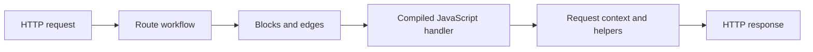

# Concepts

Fluxify lets you build an HTTP route as a visual workflow. The diagram is the source of truth; Fluxify compiles that route graph into a JavaScript handler that runs directly in Bun when a request arrives.

Use this section when you want to understand *why* a route behaves the way it does—not just how to configure a particular block.

## The route mental model

Think of every route as three connected layers:

- **A route workflow** defines what should happen for a request.
- **Blocks** do the work: read data, transform it, call a service, make a decision, or send a response.
- **Edges** connect blocks and determine what comes next.
- **The compiled handler** runs the route's JavaScript in Bun, with request-scoped helpers and state supplied by the execution context.

The usual path is simple: start with an incoming request, pass data from block to block as `input`, and finish with a response. Error paths and conditional branches are still part of the same route graph.

## A complete route, at a glance

The following route is a useful model for a production endpoint: it reads a user ID, fetches the matching user, returns a success response when one exists, and returns a 404 response when it does not. Any unexpected failure follows the separate error path and returns a controlled server error.

::: tip Start here when something is unclear

- Unsure how to model a route? Read [Blocks](./blocks.md) and [Edges](./edges.md).
- Unsure where a script value or helper comes from? Read [Execution Context](./context.md).
- Unsure how scripts are run? Read the [Scripting overview](../scripting/index.md).
- Diagnosing branching, requests, or logs? Jump to the operational concepts below.

:::

## Build the workflow

These concepts describe the route graph you create in the editor.

### [Blocks](./blocks.md)

The individual units of work in a workflow. Learn how inputs, outputs, success states, and error handling move through a route.

### [Edges](./edges.md)

The connections between blocks. Learn how they express sequencing, branching, and alternate paths.

### [Condition Evaluator](./evaluators.md)

The decision mechanism used to choose a branch from runtime data.

### [Workflows](./workflows.md)

Background work that nobody is waiting for: the same canvas and the same
blocks, started by a trigger or by hand instead of by an HTTP request.

## Understand execution

These pages explain what Fluxify provides while a request is being handled.

### [Execution Context](./context.md)

The request-scoped values and helpers available to blocks and scripts, including `input`, configuration, headers, cookies, logging, and HTTP access.

### [Scripting overview](../scripting/index.md)

How the DAG compiler emits native JavaScript for a route and executes it in Bun's JavaScriptCore runtime—without a per-request VM.

### [Execution Engine](./execution-engine.md)

How the route graph advances through blocks, returns results, and routes failures to an error handler. It also explains the optional experimental route-timeout protection.

## Connect and operate

These concepts cover the services and shared facilities that make routes useful in production.

### [App Config](./app-config.md)

Application-level configuration and secrets that routes can read safely at runtime.

### [Globals](./globals.md)

Shared application state and the trade-offs to consider before using it.

### [HTTP Client](./http-client.md)

The built-in client for calling external HTTP services from a workflow.

### [Telemetry Configuration](./telemetry-configuration.md)

How to emit, inspect, and use route logs while developing and operating an application.

## A good next step

If you are new to Fluxify, read [Blocks](./blocks.md) first, then [Edges](./edges.md). If you are writing JavaScript, pair this overview with the [Scripting overview](../scripting/index.md) and the [JavaScript API Reference](../scripting/javascript-api.md).
