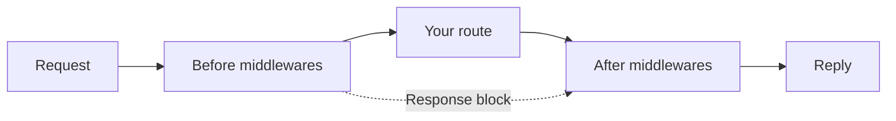

# Middlewares

Some logic belongs to many routes at once: checking an API key, logging every
request, cleaning up input, adding a header to every reply. Copying those
blocks into each route means fixing the same thing in twenty places.

A **middleware** is that logic, built once and attached to as many routes as you
like. It is a named list of [custom blocks](../blocks/custom-blocks.md) that run
one after another, **before** or **after** the route's own flow.

## How a request flows

Think of a route with middlewares as a sandwich. The route is the filling, and
the middlewares are the layers around it:



1. The **before** middlewares run first, in the order you set.
2. Then the route runs.
3. Then the **after** middlewares run, in the order you set.

If a before middleware ends in a [Response](../blocks/response.md) block, the
request is answered right there, and the route does not run. This is how a
guard says "no".

## Make a middleware

### 1. Create the blocks it uses

A middleware is made of custom blocks that are set up for this job:

1. Go to **Custom Blocks** and press **New block**.
2. In **Used for**, pick **Middleware**.
3. Build the block's canvas like any other custom block.

A middleware block:

- **takes no input parameters.** It works on the value passed to it and on the
  request itself (headers, cookies, variables).
- **can't be placed on a canvas.** It only runs as a step of a middleware.
- **keeps its "Used for" setting forever.** You pick it once, when you create
  the block.

### 2. Put the blocks in order

1. Go to **Middlewares** (under **Routes** in the sidebar) and press
   **New middleware**. Give it a name, like `Require API key`.
2. On the **Chain** step, press **Add block** and pick a middleware block. Add
   as many as you need, and drag them into the order they should run.
3. Check the **Review** step and press **Create middleware**.

Each block can appear in a middleware only once. To change a middleware later,
click it in the list: it opens the same steps, with your settings filled in. Press **Save changes** when done. The arrow next to each block
opens that block's canvas in a new tab.

### 3. Attach it to a route

1. Open the route's **Settings** and go to the **Middlewares** tab.
2. Under **Before the route** or **After the route**, press **Add middleware**.
3. Drag to change the order. Changes save right away.

A middleware can be added to a route only once, either before or after it.

## What each step receives

Every block passes its output to the next one, through `input`, the same way
blocks do on a canvas. The chain continues across middlewares too: the last
block of one middleware feeds the first block of the next.

| Step | Its `input` is |
| --- | --- |
| First before middleware | The request body |
| Each later step | The output of the step before it |
| The route | The output of the last before middleware (or the request body if there are none) |
| First after middleware | `{ httpCode, body }`: the route's status code and reply |

In an after middleware, work on `input.body`, not `input`: the reply comes in
wrapped with its status code. Once a block has reshaped `input`, the reply is
still there: `getResponseBody()` returns its body and `getResponseStatus()` its
status code, for the whole after chain. See
[Response values](../scripting/javascript-api.md#response-values) and
[Response in an after middleware](../blocks/response.md#in-an-after-middleware).

Variables are shared too. A variable set in a middleware, for example the
logged-in user, can be read by the later middlewares and by the route. You can
always read the original request with `getRequestBody()`, `getHeader()` and the
other [request helpers](../scripting/javascript-api.md).

## What ends the request

| What happens | Result |
| --- | --- |
| A before middleware reaches a Response block | That is the reply. The route is skipped, and the after middlewares still run. |
| An after middleware reaches a Response block | That is the reply. |
| The after middlewares end **without** a Response block | The reply is a **200** with the last block's output as the body. |
| A middleware block fails | See [When something fails](#when-something-fails). |

::: warning After middlewares replace the status code
An after middleware that ends without a Response block always answers **200**,
even if the route answered 201 or 404. If you need to keep the route's code,
end the after middleware with a Response block.
:::

::: tip Only use "after" when you need it
Most logic belongs **before** the route. Use an after middleware only to change
the reply, for example to add headers or reshape the body.
:::

## When something fails

Each middleware block handles its own errors, using the
[Error Handler](../blocks/error-handler.md) on its own canvas:

- If the block's error handler ends in a Response block, that is the reply, for
  example a friendly `401` or `403`.
- If the block has no error handler, or its handler doesn't end in a Response
  block, the request fails with a **500**.

The route's own error handler never sees middleware errors. It only handles the
route's own blocks.

## Example: require an API key

A middleware block named `require_api_key`:

**Entrypoint → [If](../blocks/if-condition.md) → …**

- The If block checks the header with JavaScript:
  `return getHeader("x-api-key") === getConfig("API_KEY");`
- **Success:** a [JS Runner](../blocks/js-runner.md) remembers who called, then
  passes the body on:
  ```js
  caller = "partner-app";
  return input;
  ```
- **Failure:** a [Response](../blocks/response.md) block with code `401`.

Put it in a middleware, attach it **before** your routes, and every one of them
is protected. The routes can read `caller` like any other variable.

## Example: add a header to every reply

A middleware block named `served_by`, attached **after** the route:

**Entrypoint → [Set HTTP Header](../blocks/set-http-header.md) → JS Runner → Response**

- Set HTTP Header sets `x-served-by` to `fluxify`.
- The JS Runner hands back the route's body: `return input.body;`
- The Response block answers with code `200`.

## Good to know

- Middlewares run on **routes only**. [Workflows](./workflows.md) have no
  request to guard, so they don't use them.
- [Test suites](../testing/index.md) run a route's middlewares too, so your
  tests see exactly what callers see.
- A middleware that routes still use can't be deleted. Remove it from those
  routes first.
- A custom block that a middleware still uses can't be deleted. Remove it from
  those middlewares first.
- Changing a middleware updates every route that uses it.
