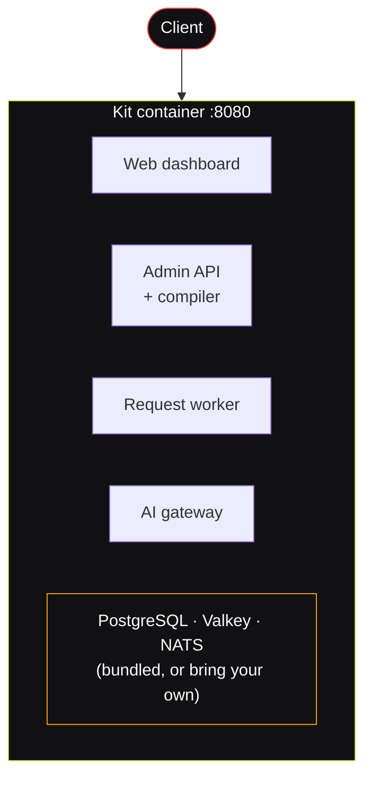
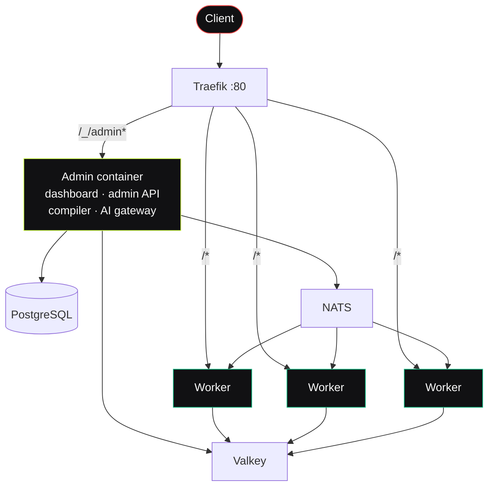

# Self-Hosting Fluxify

Fluxify is built to run on your own infrastructure. There are **two ways** to
deploy it, and this page helps you pick the right one and points you to the exact
steps for each.

> [!TIP]
> New to how Fluxify works internally? The [Architecture](/architecture/) section
> explains the control plane / worker split that both setups below are built on.

> [!WARNING]
> **Alpha software.** Fluxify is in active alpha development. It is suitable for
> self-hosted trials and early production use, but internal schemas may change
> between versions — read the release notes before upgrading.

---

## The two ways to run Fluxify

| | **Kit** (all-in-one) | **Admin + Workers** (scale-out) |
| :--- | :--- | :--- |
| **Best for** | Trials, demos, single-machine hosting | Real production traffic |
| **Containers** | One — database, cache and event bus included | Separate admin + many workers |
| **Scaling** | Vertical only (bigger machine) | Horizontal — add workers on demand |
| **Edge proxy** | Built into the image | Traefik (load-balances the workers) |
| **Setup effort** | Lowest — one command | Moderate |
| **Guide** | [Quick Run with the Kit Image →](./kit) | [Production Setup →](./production) |

### Which should I choose?

- **Just trying Fluxify, running a demo, or hosting on one machine?**
  Use the **Kit**. It bundles every service into a single container and starts
  with one command. → [Quick Run guide](./kit)

- **Serving production traffic, or expecting load that one machine can't handle?**
  Use **Admin + Workers**. The control plane runs once; stateless workers scale
  horizontally behind Traefik. → [Production guide](./production)

> [!TIP]
> Start with the Kit to evaluate, then move to Admin + Workers when you need to
> scale — your `.env` and database carry straight over.

---

## How the pieces fit together

Both topologies share the same three backing services and the same URL layout —
they differ only in how the application containers are split up.

**Kit — everything in one container:**

**Admin + Workers — control plane split from a worker pool:**

Notice that only the admin container reaches PostgreSQL. Workers receive your
routes ready to run over NATS, so they never need database access — see
[Request Lifecycle](/architecture/request-lifecycle).

### Backing services (both setups)

| Service | Role |
| :--- | :--- |
| **PostgreSQL** | Stores workflows, project configuration, and user accounts. Only the admin container connects to it. |
| **Valkey / Redis** | Caching and fast lookups. |
| **NATS** | Delivers compiled routes to workers and keeps live configuration in sync. |

> [!WARNING]
> **NATS must be started with JetStream enabled** (`-js` on the command line).
> Fluxify uses it to queue compile work and to store the compiled routes that
> workers pull. Without it the compiler will not start and your workers will
> have nothing to serve. The bundled compose files already set this.

### URL layout (both setups)

| Path | Serves |
| :--- | :--- |
| `/_/admin/ui` | Web dashboard (visual editor) |
| `/_/admin/api` | Admin REST API |
| `/_/admin/api/openapi/ui` | API documentation |
| `/` | Your published workflows and custom endpoints |

> [!NOTE]
> **Namespace isolation.** Everything under `/_/admin` is platform management and
> the visual editor. The entire root path `/` is reserved for the endpoints you
> build in Fluxify, so your APIs never collide with the admin surface.

---

## System requirements

| Resource | Kit (trial) | Admin + Workers (production) |
| :--- | :--- | :--- |
| **CPU** | 1 core | 2+ cores (plus ~1 core per worker) |
| **RAM** | 2 GB | 4 GB+ |
| **Disk** | 5 GB | 20 GB+ SSD |
| **Docker** | Engine 20.10+ / Desktop | Engine 20.10+ |

---

## Generate your secret keys

Both setups need the same secrets in their `.env`. Generate them once here, then
follow the guide for your chosen setup:

- `MASTER_ENCRYPTION_KEY` — encrypts stored credentials.
- `BETTER_AUTH_SECRET` — signs authentication sessions.

<KeyGenerator />

> [!WARNING]
> Back up `MASTER_ENCRYPTION_KEY`. If you lose or change it after storing data,
> every saved credential becomes permanently unreadable.

> [!IMPORTANT]
> **Admin and workers must share the same `MASTER_ENCRYPTION_KEY`.** Project
> configuration reaches workers encrypted with it; a worker with a different key
> starts up and then fails every request. A worker refuses to start without one.

### One more setting: which project a worker serves

Each request worker serves exactly **one** project, named by `WORKER_PROJECT_ID`.
You get that id from the project's settings page in the dashboard.

This is why you create a project *before* the worker can run — on a first
install there simply isn't one yet. Both guides walk you through the two-step
start.

To serve several projects, run a separate group of workers for each. Copies of
the same worker share their settings, so they always share a project.

::: tip Serving every project from one worker
Set `WORKER_PROJECT_ID` to `*` and the worker serves every project you have,
picking up new ones as you create them — no restart, no id to copy.

Good for a personal install or a staging box. Not recommended when projects
belong to different people: they share one worker, so a route path used by two
projects can only resolve to one of them, and a slow project slows the rest.
:::

---

## Next steps

Pick your path and jump straight to the steps:

- **Kit:** [run one command](./kit#bundled) →
  [turn on the request worker](./kit#worker)
- **Admin + Workers:** [why Traefik](./production#why-traefik) →
  [create your `.env`](./production#env) → [start the stack](./production#start) →
  [scale the workers](./production#scaling)
